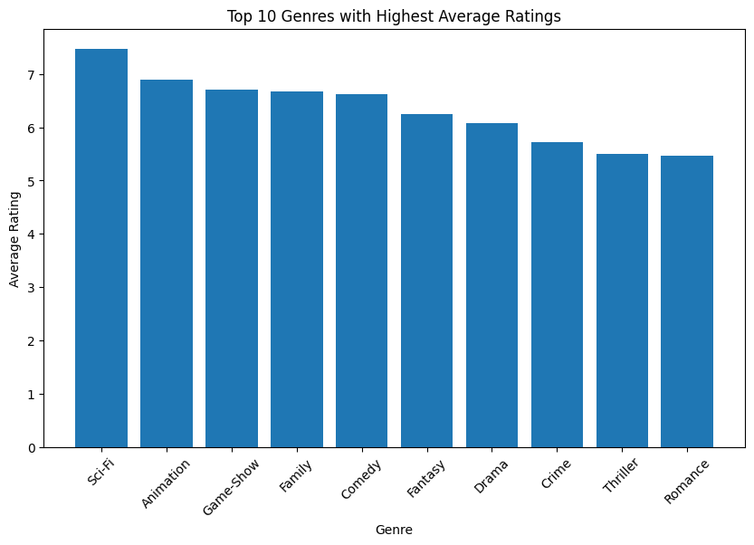
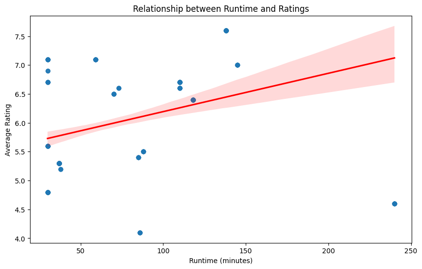
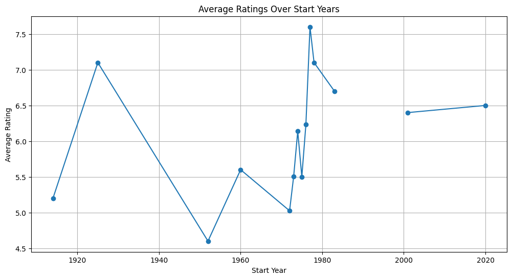

# Film and Television Success Analysis

## Overview

This project analyses large-scale film and television datasets to identify key factors influencing production success, audience ratings, and content performance.

The analysis integrates cloud infrastructure, distributed data processing, SQL-based data merging, and visual analytics to process and analyse large-scale entertainment datasets.

## Business Questions

The project explores the following questions:

1. Which genres are associated with the highest average ratings?
2. Do titles with higher ratings tend to have longer or shorter runtimes?
3. Do titles released in certain years tend to have higher ratings?
4. Which title types have the highest average ratings?
5. Is the profession of cast and crew members associated with title ratings?
6. Do titles with greater diversity of job categories receive higher ratings?
7. Is there a relationship between the birth year of cast and crew and title ratings?
8. Does genre diversity influence title ratings?

## Data Sources

The analysis integrates several film and television datasets including:

- `title.ratings`
- `title.basics`
- `title.akas`
- `name.basics`
- `title.principals`

These datasets were cleaned, transformed, and merged into a unified analytical dataset.

## Data Processing Workflow

The data processing pipeline involved the following stages:

1. Data ingestion from cloud storage
2. Data cleaning and preprocessing
3. Data integration across multiple datasets
4. Exploratory analysis and statistical evaluation
5. Visualisation of analytical results

PySpark was used extensively for:

- handling missing values
- removing duplicates
- transforming data types
- dataset merging using Spark SQL
- preparing the final analytical dataset

## Tools & Technologies

- Python
- PySpark
- Spark SQL
- Pandas
- Matplotlib
- Seaborn
- AWS
- MongoDB
- PyMongo
- Google Colab

## Key Analysis Areas

The analysis investigates:

- genre performance and ratings
- runtime and rating correlation
- rating trends over release years
- title type popularity
- profession and rating relationships
- job category diversity
- cast and crew demographics
- genre diversity and rating patterns

## Outcome

This project demonstrates an end-to-end data analytics workflow, delivering actionable insights into factors that drive content performance in the film and television industry.

## Visual Insights

### Top Genres by Average Rating

---

### Runtime vs Average Rating

---

### Rating Trends Over Time

---

This project highlights practical experience in handling large datasets, building scalable data pipelines, and translating analytical results into meaningful business insights.
